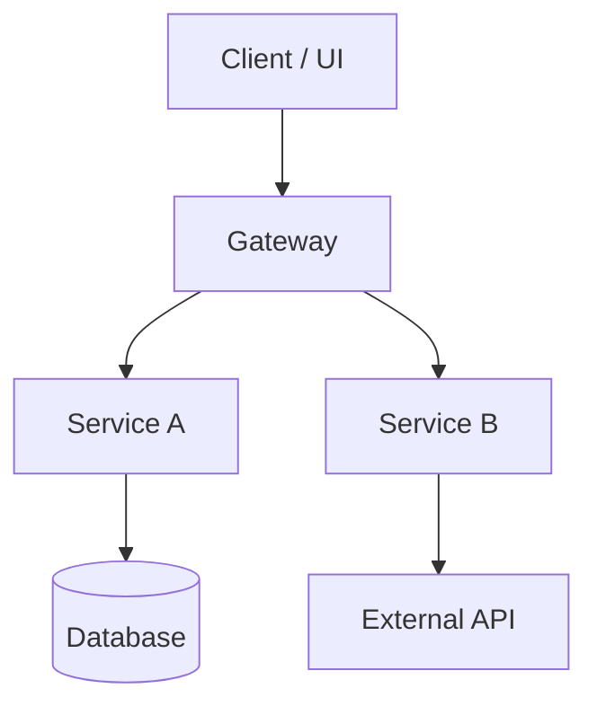
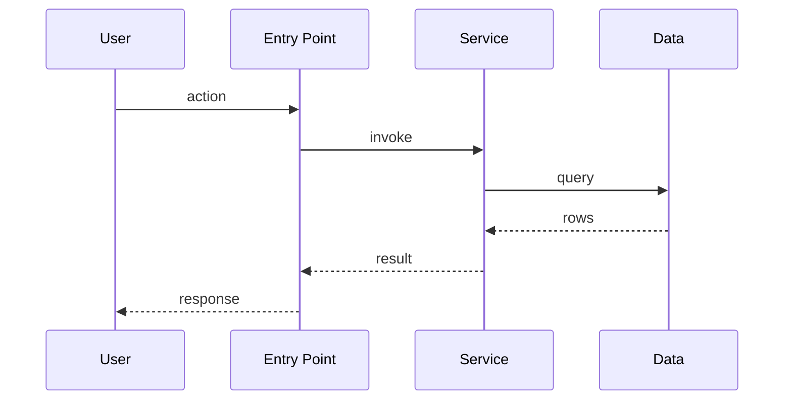

# Architecture and Walkthrough

## Overview

Concise system overview and purpose. Include a Mermaid diagram showing top-level subsystems and their relationships.



## Runtime Flow

Mermaid sequence diagram of a canonical request from entry point to response. Anchor each participant to a real file path.



Below the diagram, keep an ASCII fallback for greppability:

```text
user/action -> entry point -> service/domain -> data/integration -> response/output
```

## Key Modules

| Module | Purpose | Key Paths |
|---|---|---|
| | | |

## Key Files

| Path | Why It Matters |
|---|---|
| `path/file` | |

## Data Flow

How data enters, moves through, and leaves the system.

## Integration Points

| Integration | Direction | Purpose | Config Source |
|---|---|---|---|
| | | | |

## Request / Event Lifecycle

Step-by-step lifecycle grounded in code paths.

## Operational Gotchas

Repo-backed constraints, caveats, and failure modes.

## Related Docs

- [Documentation map](./README.md)
